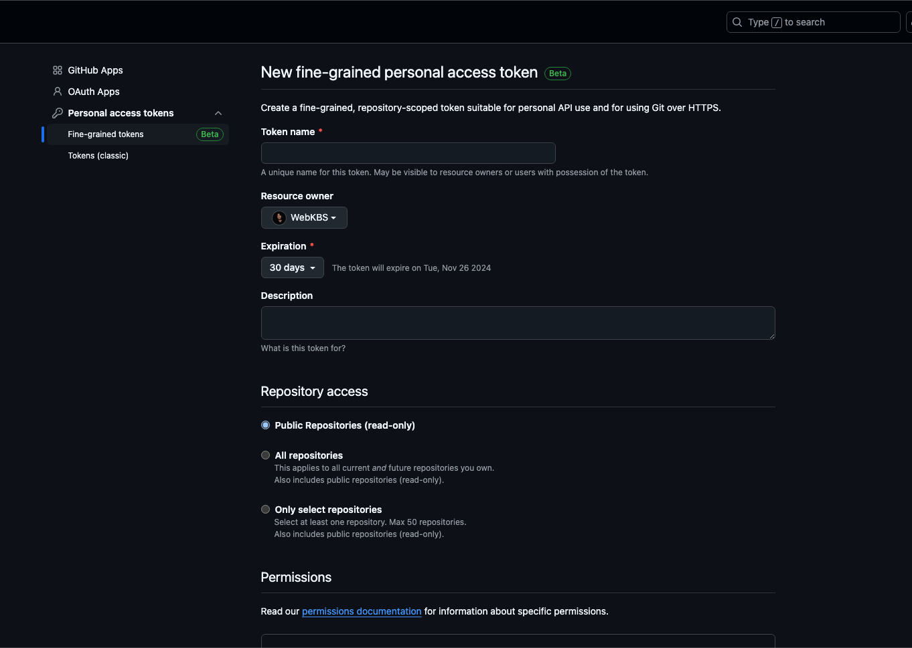

> 보안상 환경변수를 따로 제공하지 않아 아래 설명에서 github 토큰 생성을 참고하여 진행해주세요.

## 프로젝트 버전
- Next.js: 14.2.15
- React: ^18
- TypeScript: ^5
- tanstack/react-query: ^5.59.15
- zustand: ^5.0.0

## 프로젝트 실행

### 패치지 설치
```bash
$ npm install
```

### 개발 서버 실행
```bash
$ npm run dev
```

### url 접속
- http://localhost:3000

### 프로덕션 빌드
```bash
$ npm run build
```

### 프로덕션 서버 실행
```bash
$ npm run start
```

### 프로덕션 서버 url 접속
- http://localhost:3000

**Localhost 주소는 환경에 따라 포트가 다를 수 있습니다. 터미널 확인해주세요.**

## 환경변수 설정

### .env 파일 생성
```bash
$ touch .env
// 또는 root에 파일 생성 후 내용 추가
```

### .env 파일 내용
```
GITHUB_TOKEN=YOUR_GITHUB
```

### github token 발급

- github 접속후  `Settings` -> `Developer settings` -> `Personal access tokens` -> `fine-grained tokens` ->`우측 상단 Generate new token` 클릭



Token name을 입력하고 Repository access에서 Public Repositories 를 선택 후 `Generate token` 클릭하여 토큰 생성합니다.

발급 받은 토큰을 .env 파일에 추가합니다. `GITHUB_TOKEN=발급받은토큰`

만약 해당 내용 실행이 어려울시 kbs21c1987@gmail.com 으로 연락주세요.

## 구현 내용
- url search params를 이용한 검색 기능
- 총 검색 결과 수 및 북마크 수치 표시
- zustand 상태관리를 이용한 localstorage 저장
- token 노출을 방지하기 위해 next api route 핸들러를 이용한 github api 호출
- react-query와 react-intersection-observer를 이용한 무한 스크롤 구현
- scroll top 버튼 및 toast 메세지를 추가하여 사용자 경험(UX) 향상